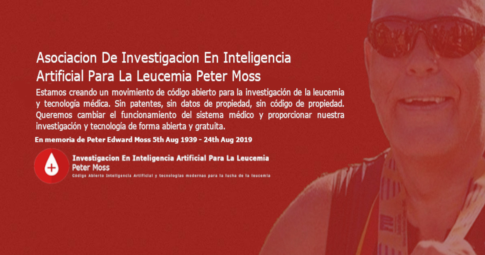

# Asociacion De Investigacion En Inteligencia Artificial Para La Leucemia Peter Moss
## ALL-IDB Classifiers
### ALL Papers Evaluation (Paper 1)



&nbsp;

# Table Of Contents

- [Introduction](#introduction)
- [DISCLAIMER](#disclaimer)
- [Getting Started](#getting-started)
  - [Gain access to ALL-IDB](#gain-access-to-all-idb)
  - [Clone the repository](#clone-the-repository)
    - [Developer Forks](#developer-forks)
- [Evaluations](#evaluations)
- [Contributing](#contributing)
    - [Contributors](#contributors)
    - [Student Contributors](#student-contributors)
- [Versioning](#versioning)
- [License](#license)
- [Bugs/Issues](#bugs-issues) 

&nbsp;

# Introduction
This project evaluates [Acute Leukemia Classification Using Convolution Neural Network In Clinical Decision Support System](https://airccj.org/CSCP/vol7/csit77505.pdf "Acute Leukemia Classification Using Convolution Neural Network In Clinical Decision Support System") by Thanh.TTP, Giao N. Pham, Jin-Hyeok Park, Kwang-Seok Moon, Suk-Hwan Lee, and Ki-Ryong Kwon.

The purpose of the project is to recreate the networks proposed in the paper, and compare results. 

&nbsp;

# DISCLAIMER
This project should be used for research purposes only. The purpose of the project is to show the potential of Artificial Intelligence for medical support systems such as diagnosis systems.

Although the classifiers are accurate and show good results both on paper and in real world testing, they are not meant to be an alternative to professional medical diagnosis.

Developers that have contributed to this repository have experience in using Artificial Intelligence for detecting certain types of cancer. They are not a doctors, medical or cancer experts.

Please use these systems responsibly.

&nbsp;

# Getting Started

To get started with this project there are a couple of things for you to collect.

## Gain access to ALL-IDB

You need to be granted access to use the Acute Lymphoblastic Leukemia Image Database for Image Processing dataset. You can find the application form and information about getting access to the dataset on [this page](https://homes.di.unimi.it/scotti/all/#download) as well as information on how to contribute back to the project [here](https://homes.di.unimi.it/scotti/all/results.php). If you are not able to obtain a copy of the dataset please feel free to try this tutorial on your own dataset, we would be very happy to find additional AML & ALL datasets..com/COVID-19-AI-Research-Project/AI-Classification/tree/master/Projects/3) tutorial as this is the project that creates the classifier that the Magic Leap 1 will interact with. 

## Clone the repository

Clone the [ALL-IDB Classifiers](https://github.com/LeukemiaAiResearch/ALL-IDB-Classifiers " ALL-IDB Classifiers") repository from the [Asociacion De Investigacion En Inteligencia Artificial Para La Leucemia Peter Moss](https://github.com/LeukemiaAiResearch "Asociacion De Investigacion En Inteligencia Artificial Para La Leucemia Peter Moss") Github Organization.

To clone the repository and install the ALL-IDB Classifiers, make sure you have Git installed. Now navigate to the home directory on your device using terminal/commandline, and then use the following command.

```
$ git clone https://github.com/LeukemiaAiResearch/ALL-IDB-Classifiers.git
```

Once you have used the command above you will see a directory called **ALL-IDB-Classifiers** in your home directory.

```
ls
```

Using the ls command in your home directory should show you the following.

```
ALL-IDB-Classifiers
```

Navigate to **ALL-IDB-Classifiers** directory, this is your project root directory for this tutorial.

### Developer Forks

Developers from the Github community that would like to contribute to the development of this project should first create a fork, and clone that repository. For detailed information please view the [CONTRIBUTING](../../CONTRIBUTING.md "CONTRIBUTING") guide. You should pull the latest code from the development branch.

```
  $ git clone -b "0.1.0" https://github.com/LeukemiaAiResearch/ALL-IDB-Classifiers.git
```

The **-b "0.1.0"** parameter ensures you get the code from the latest master branch. Before using the below command please check our latest master branch in the button at the top of the project README.

&nbsp;

# Evaluations
Use the links below to replicate the evaluation projects.

| Evaluation     | Status | Link |
| -------------------- | ----- | ---------- |
| Paper 1 Evaluation | Complete   | [Paper 1 Evaluation](Evaluations/Paper-1.md "Paper 1 Evaluation")     |
| Paper 1 Augmentation Evaluation | Complete   | [Paper 1 Augmentation Evaluation](Evaluations/Paper-1-Augmentation.md "Paper 1 Augmentation Evaluation")     | 

&nbsp;

# Contributing

Asociacion De Investigacion En Inteligencia Artificial Para La Leucemia Peter Moss encourages and welcomes code contributions, bug fixes and enhancements from the Github.

Please read the [CONTRIBUTING](../../CONTRIBUTING.md "CONTRIBUTING") document for a full guide to forking our repositories and submitting your pull requests. You will also find information about our code of conduct on this page.

## Contributors

- [Adam Milton-Barker](https://www.leukemiaresearchassociation.ai/team/adam-milton-barker "Adam Milton-Barker") - [Asociacion De Investigation En Inteligencia Artificial Para La Leucemia Peter Moss](https://www.leukemiaresearchassociation.ai "Asociacion De Investigation En Inteligencia Artificial Para La Leucemia Peter Moss") President & Lead Developer, Sabadell, Spain

&nbsp;

# Versioning

We use SemVer for versioning.

&nbsp;

# License

This project is licensed under the **MIT License** - see the [LICENSE](../../LICENSE "LICENSE") file for details.

&nbsp;

# Bugs/Issues

We use the [repo issues](../../issues "repo issues") to track bugs and general requests related to using this project.
